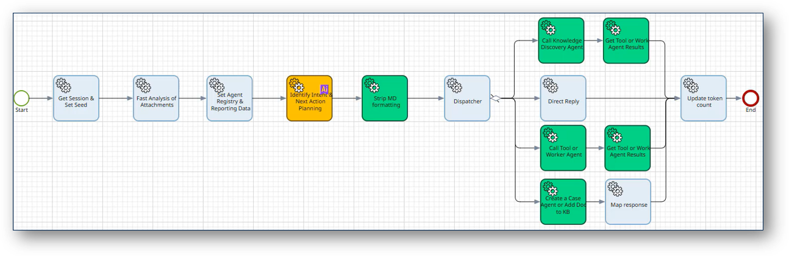
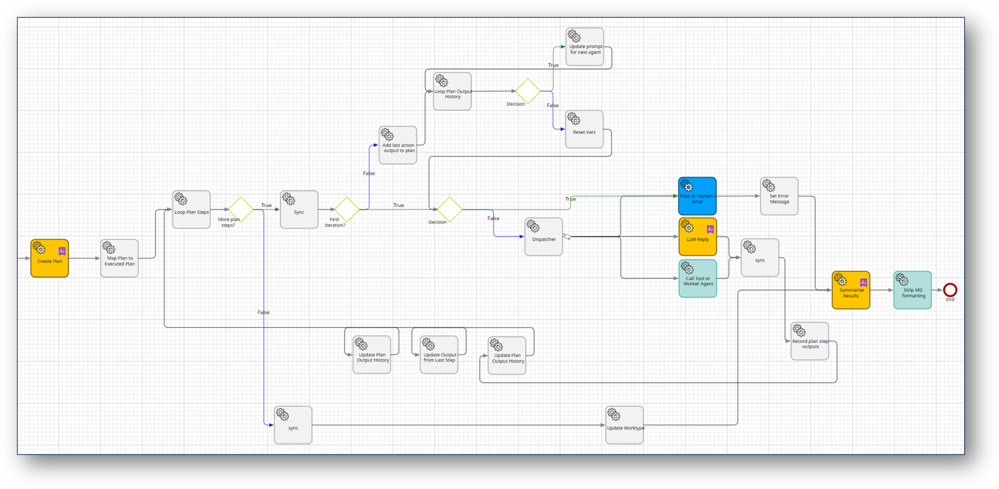
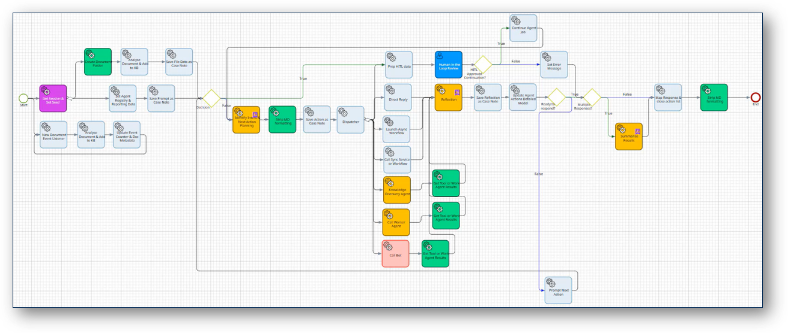
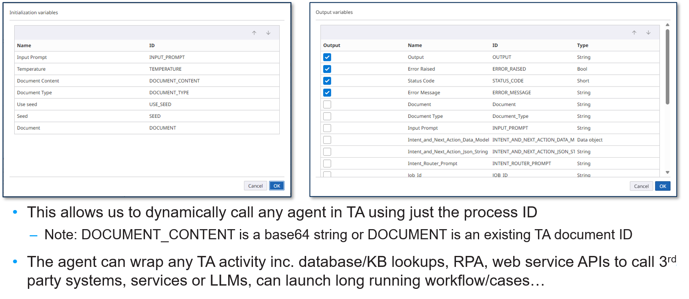

# Agentic Design Patterns for TotalAgility

Sample packages demonstrating agentic design patterns using Tungsten TotalAgility 2026.1+ low-code process orchestration.

> **Learn More**: See [How to Build Enterprise Grade AI Agents with Agentic Design Patterns](https://www.tungstenautomation.com/learn/blog/build-enterprise-grade-ai-agents-agentic-design-patterns)

> **Watch the Webinar**: On demand [How to Build AI Agents with Agentic Design Patterns](https://www.tungstenautomation.com/learn/webinars/how-to-build-ai-agents-with-agentic-design-patterns)

## Table of Contents

- [Included Patterns](#included-patterns)
- [Prerequisites](#prerequisites)
- [Quick Start](#quick-start)
- [Approach](#approach)
- [Package Contents](#package-contents)
- [Repository Structure](#repository-structure)
- [Setup Instructions](#setup-instructions)
- [Using the Postman Collection](#using-the-postman-collection)
- [Next Steps](#next-steps)
- [Additional Resources](#additional-resources)

## Included Agentic Patterns

### Included in This Package
- **[The Reflection Pattern](https://www.tungstenautomation.com/learn/blog/the-agentic-ai-reflection-pattern)** - Demonstrates AI agents that analyze and improve their own outputs


- **[The Tool-Use Pattern](https://www.tungstenautomation.com/learn/blog/the-agentic-ai-tool-use-pattern)** - Shows how agents dynamically select and invoke tools


### Available by Request
- **[The Planning Pattern](https://www.tungstenautomation.com/learn/blog/the-agentic-ai-planning-pattern)** - Plan-Act shows strategic planning and decomposition of complex tasks


- **[The Multi-Agent Pattern](https://www.tungstenautomation.com/learn/blog/the-agentic-ai-multi-agent-pattern)** - Plan-Act-Reflect-Repeat shows orchestrating multiple agents working together, open ended task completion & case management 



### Related Projects

- **[TotalAgility Example Agent using an Agentic Loop](https://github.com/TungstenAutomationLabs/TotalAgilityExampleAgent)** - Full-featured managing agent implementation example, calling tools and worker agents in an agentic-loop for goal completion


## Prerequisites

- Tungsten TotalAgility 2026.1 or higher
- Access to the TotalAgility platform with administrative or developer privileges
- [Postman](https://www.postman.com/) (optional, for testing REST endpoints)
- Basic familiarity with TotalAgility workflows, cases, and services

## Quick Start

1. **Import the Package** - Import the TotalAgility package into your environment
2. **Configure Web Services** - Update the TA Base URL in System Data (see [Setup Instructions](#setup-instructions))
3. **Explore Examples** - Navigate to `Category: Agentic Design Pattern Examples` to review agent templates
4. **Test with Postman** - Use the included Postman collection to test agents with REST calls
5. **Build Your Tools** - Create custom tools/agents and register them in the `Agent Tool Registry` 

## Approach

The **Tool-Use** pattern is built on the principle of **modular, composable agents**. Key design features:

- **Unified IO Signature** - All agents, workflows, services, and cases share the same input/output contract, making them universally pluggable
- **Dynamic Tool Invocation** - Agents can invoke any registered tool or worker agent without needing custom steps or configurations
- **Flexible Data Handling** - Structured data requests (JSON, etc.) are handled via `INPUT_PROMPT`—simply describe the expected format in the registry and the agent handles the rest

The result is an agent that adapts to available tools without modifications, enabling rapid iteration and extensibility.



### Registry Variable Data Model Format
Which worker agents and tools are available for an agent to use, is controled by a registry. The format is defined as a data model, which is used in the prompts & output of planing activities. In the Tool Use Pattern example, the registry data is stored as a global variable. 
In scenarios where the agent has access to a large number of tools, as an alternative use using a variable, condir:
 - semantic tool lookup from the knowledge base (requires TotalAgility Enterprise)
- a custom service wrapping dynamic or hierarchical tool lookup
- a variable that can be dynamically applied as skin to a manang agent
- using MCP (Model Context Protocol)

For an example of the tool registry data model, see: `registry/Agent Tool Registry.json`. Each tool entry includes:

- `intent` (string) – the type of tool to be called (e.g. `sync_agent`, `direct_reply`)
- `processID` (string) – the TotalAgility process GUID or "NA" for inline handlers
- `version` (number) – version of the agent/process definition
- `name` (string) – human‑readable name shown in logs and UIs
- `max_invocations_per_cycle` (string/number) – throttle count for the tool per cycle
- `description` (string) – explanation of what the agent does & any instructions on how to call the agent 

#### Actual Example from the Repository

```json
{
  "agent_processes": [
    {
      "intent": "direct_reply",
      "processID": "NA",
      "version": 1.0,
      "name": "Direct Reply",
      "max_invocations_per_cycle": "1",
      "description": "Responds directly back to the user with the provided prompt, without any additional actions by agents."
    },
    {
      "intent": "sync_agent",
      "processID": "6B8642DEC8B24FF1925FAE0CA0BAE778",
      "version": 1.0,
      "name": "Example - Sync Agent",
      "max_invocations_per_cycle": "1",
      "description": "Example agent to test calling a synchronous worker agent. Include details of any expected data or formatting requirements here, inc. an example of use."
    }
    // more entries follow...
  ]
}
```

#### Editing the Registry

1. Open `registry/Agent Tool Registry.json` in a text editor.
2. Add, remove or update objects in the `agent_processes` array.
3. Save the file and ensure your TotalAgility environment picks up the changes (re‑import the global variable if necessary).
4. Match the `intent` values with those your main agent uses when selecting tools.

> **Note:** Keeping `intent` and `processID` accurate is critical; mismatches cause tool lookups to fail at runtime.


## Package Contents

### Agent Examples (Category: Agentic Design Pattern Examples)

| Agent | Purpose |
|-------|---------|
| **Example - Async Agent** | Template for async workflow invocation. ⚠️ Use automatic steps only; for human-in-the-loop, use a Case |
| **Example - Sync Agent** | Template for synchronous agent calls |
| **Example - Case Agent** | Template for launching long-running cases, including those with human-in-the-loop activities |
| **Reflection - Report Formatting Agent** | Demonstrates the Reflection pattern with AI output improvement |
| **Tool Use - Chat Agent** | Demonstrates the Tool-Use pattern with dynamic tool selection |
| **Global Variable: Agent Tool Registry** | Contains the ```Agent Tool Registry.json``` providing a registry of available tools and worker agents for the Tool-Use agent |

### Supporting Services (Category: Agent Services)

| Component | Function |
|-----------|----------|
| **Service - Analyse Document (Sync)** | Provides metadata about files to calling agents |
| **Service - Base64 to TA Document** | Converts Base64 to TotalAgility Documents (avoids passing large data blocks as variables) |
| **AgentWorktype** | Example worktype for agent tracking and monitoring |
| **MDCleaner.dll** | Utility to remove Markdown formatting from AI-generated JSON and HTML |

### Custom Services

| Service | Purpose |
|---------|---------|
| **Get Session** | Retrieves the user's session ID for tool invocation, ensuring tools run with the same permissions as the agent caller |

### Document Management

- **TotalAgility Agent Documents Extraction Group** - Classifies documents processed by agents, allowing independent configuration of retention and knowledge base settings

### ⚠️ Important Note

These examples are **templates only** and are not fully functional agents. To make them operational:

1. **Create custom tools** - Build domain-specific worker agents and services
2. **Register tools** - Add them to the `Agent Tool Registry` variable
3. **Alternative registry approaches**:
   - Proxy service for dynamic tool provision
   - Semantic intent routing using the knowledge base
   - Model Context Protocol (MCP) server integration


## Repository Structure

```
.
├── LICENSE                           # License file
├── README.md                         # This file
├── images/                           # Documentation images
│   └── Agent_IO_Signature.png       # Visual diagram of the agent architecture
├── packages/                         # TotalAgility packages
│   └── Agentic Design Patterns Examples.zip    # Importable TotalAgility package with agent templates
├── postman/                          # API testing resources
│   └── Agentic_Design_Patterns_For_TotalAgility.postman_collection.json  # REST API examples
├── prompts/                          # Agent prompt templates and patterns
│   ├── Identify Intent & Next Action Planning.md     # Prompt for intent identification and planning
│   ├── reflection.md                 # Prompt template for the Reflection pattern
│   └── Report Formatting & Styling Agent.md          # Prompt for report formatting and styling
└── registry/                         # Tool and agent registry
    └── Agent Tool Registry.json      # JSON registry of available tools and agents
```

### Key Files Explained

| File/Folder | Purpose |
|-------------|---------|
| **packages/Agentic Design Patterns Examples.zip** | Main TotalAgility package. Import this into your TotalAgility environment to get all agent templates and supporting services. |
| **prompts/*.md** | System prompts for agent implementations. Reference these or customize them for your agents. |
| **registry/Agent Tool Registry.json** | Central registry mapping tools to their names, descriptions, and signatures. Agents reference this to discover available tools. |
| **postman/...json** | Pre-built REST API requests for testing agents. Import into Postman for quick validation. |

## Setup Instructions

### Configure Web Service References

After importing the package:

1. Navigate to **System Data** > **Web Service References**
2. Set the category to **"Default Category"**
3. Edit the web service **"TA Base URL"** and replace `{{your_host}}` with your TotalAgility hostname:
   ```
   https://{{your_host}}/services/sdk/v1/
   ```

### Create Custom Agents and Tools

Once configured, you can extend the framework:

1. Create new agents, workflows, or cases using the **"agent" IO signature** defined in the package
2. Update the **`Agent Tool Registry`** global variable with details of your new tools
3. The Tool-Use agent will automatically discover and invoke them

> **Tip**: You don't need to modify the agent step configuration—just update the registry and your tools become available!

## Using the Postman Collection

The `Agentic_Design_Patterns_For_TotalAgility.postman_collection.json` file contains example REST calls for invoking agents with and without document attachments.

### Setup

1. Import the collection into [Postman](https://www.postman.com/)
2. Create an environment with the following variables:
   - `host` - DNS hostname of your TotalAgility environment
   - `SPP_SYSTEM_SESSION_ID` - Session ID (obtain from your TotalAgility environment)
   - `user_name` - Username of the account invoking the agents

### Integration

These REST APIs enable agent invocation from external systems such as:
- Microsoft Teams (see [TotalAgility-MSTeams-Agent](https://github.com/TungstenAutomationLabs/TotalAgility-MSTeams-Agent))
- Custom integrations and workflows
- Low-code platforms
	
## Next Steps

1. **Review the examples** - Open each agent template and understand how it uses the IO signature
2. **Examine the registry** - Look at `Agent Tool Registry` to see how tools are registered
3. **Create a test tool** - Build a simple worker agent and register it
4. **Test with Postman** - Use the collection to invoke agents and validate behavior
5. **Build your domain tools** - Extend with custom agents tailored to your processes

## Additional Resources

- **[Agents & RAG with TotalAgility](https://view-su2.highspot.com/viewer/3c5567ff29b0def9a15fd08eebb06230)** - Demos, videos, and additional content
- **[TotalAgility Example Agent](https://github.com/TungstenAutomationLabs/TotalAgilityExampleAgent)** - Fully implemented agentic loop example
- **[TotalAgility-MSTeams-Agent](https://github.com/TungstenAutomationLabs/TotalAgility-MSTeams-Agent)** - Agent integration with Microsoft Teams


